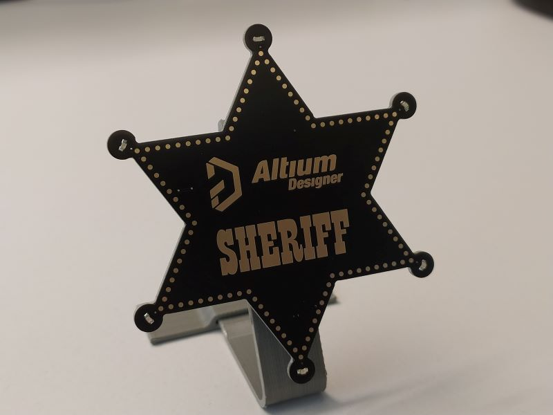
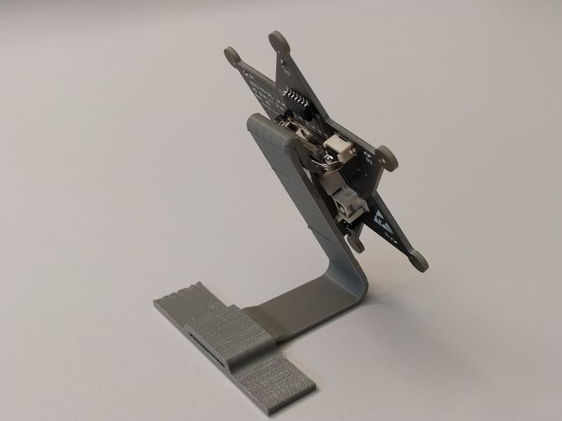
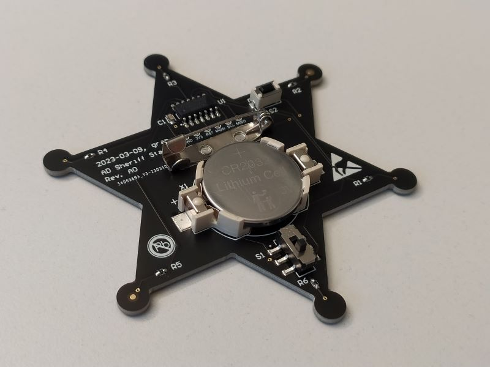
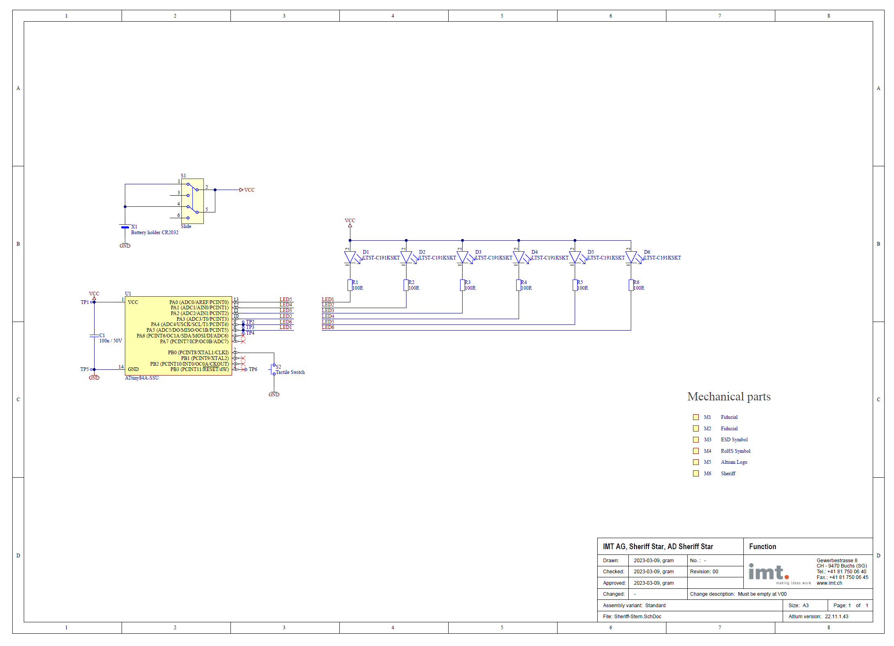

# Altium-Sheriff-Star
PCB with Sherif-Star shape and 6 animated LEDs on it. It has the Altium Logo on the front and the Test SHERIFF.
I also designed a holder to display the sheriff star on your desk.

   

  

## SW-Requirements
* [Arduino IDE](https://www.arduino.cc/en/main/software) (V 2.0.4)
* Board support "ATtiny/ATmega Standalone" (V 0.1.0)

## Hardware
The hardware consists of:
* [PCB Altium Sheriff Star](https://github.com/grafmar/Altium-Sheriff-Star/tree/main/pcb):
  * 6x Yellow LED 0603
  * 6x 100&Omega; 0402
  * 1x ATTINY84A-SSU
  * 1x CR2032 holder with CR2032 battery (Renata, SMTU2032-LF)
  * 1x slide switch (C&K, JS202011SCQN)
  * 1x tactile switch (Alps, SKQMASE010)
  * 1x 100nF 060
  * 1x 25mm [Safety Pins Brooch](https://www.aliexpress.com/item/4000026759489.html)

Schematics:

## Author
[Marco Graf](https://github.com/grafmar)
